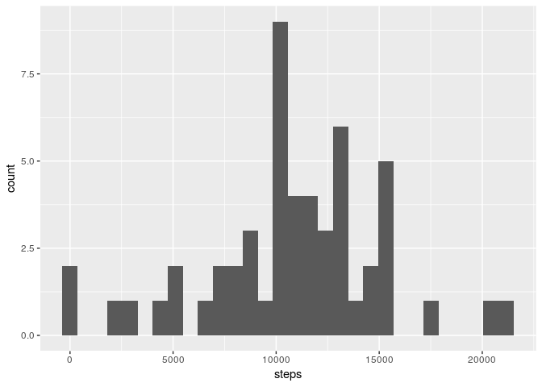
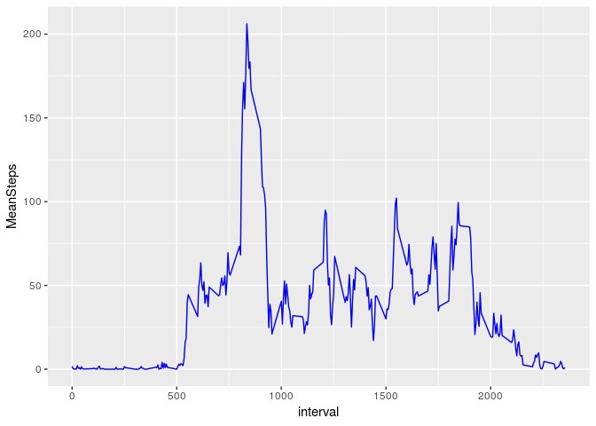
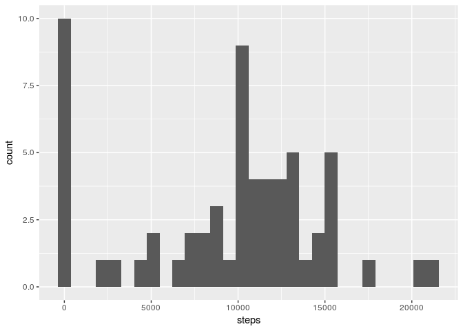
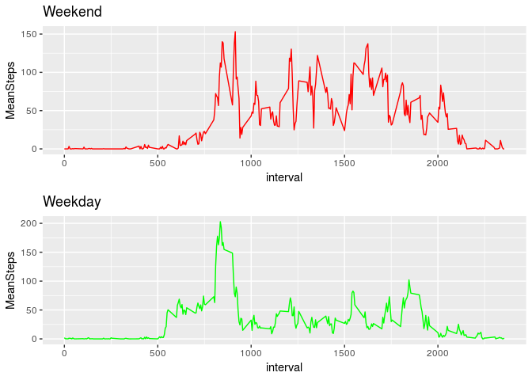

### Code to read and prep data

```r
require("dplyr")
```

```
## Loading required package: dplyr
```

```
## 
## Attaching package: 'dplyr'
```

```
## The following objects are masked from 'package:stats':
## 
##     filter, lag
```

```
## The following objects are masked from 'package:base':
## 
##     intersect, setdiff, setequal, union
```

```r
require("ggplot2")
```

```
## Loading required package: ggplot2
```

```
## Registered S3 methods overwritten by 'ggplot2':
##   method         from 
##   [.quosures     rlang
##   c.quosures     rlang
##   print.quosures rlang
```

```r
#Dataset URL
URL <- "https://d396qusza40orc.cloudfront.net/repdata%2Fdata%2Factivity.zip"
#Check if zip has been downloaded. If not, download, read csv into two data frames:
#1) original 2) original with NA's omitted
if(!file.exists("data.zip")){
  download.file(URL,"data.zip")
  unzip("data.zip")
}
if(!exists("dat")){
  #dat is unchanged dataset, datNoH removes NA's
  dat <- read.csv("activity.csv", header = TRUE, sep = ",")
  datNoH <- na.omit(dat)
  }
```

### Mean number of steps per day (ignoring missing values in the dataset)
#### 1) Total number of steps per day

```r
#use dplyr to group by date and calculate sum of steps per day
stepsDay <- datNoH %>% group_by(date) %>% summarize_all(sum)
```
#### 2) Histogram of the total numebr of steps taken each day

```r
ggplot(stepsDay, aes(x=steps)) + geom_histogram()
```

```
## `stat_bin()` using `bins = 30`. Pick better value with `binwidth`.
```

<!-- -->

#### 3) Calculate and report mean and median of the total number of steps per day


```r
summary(stepsDay$steps)
```

```
##    Min. 1st Qu.  Median    Mean 3rd Qu.    Max. 
##      41    8841   10765   10766   13294   21194
```
or

```r
meanSteps <- mean(stepsDay$steps) %>% print()
```

```
## [1] 10766.19
```

```r
medSteps <- median(stepsDay$steps) %>% print()
```

```
## [1] 10765
```
### Average daily activity pattern
#### 1) Time series plot of interval vs average steps taken across days


```r
stepsint <- datNoH %>% group_by(interval) %>% summarize(MeanSteps = mean(steps))
ggplot(data = stepsint, aes(x=interval, y = MeanSteps))+geom_line(color = "blue")
```

<!-- -->

#### 2) Which 5 minute interval contains the max number of steps?

```r
as.integer(stepsint[which.max(stepsint$MeanSteps),1])
```

```
## [1] 835
```

### Imputing missing values
#### 1) Number of missing values in dataset

```r
length(dat$steps)-length(datNoH$steps)
```

```
## [1] 2304
```
#### 2) Fill in missing values in dataset.  Approach: if all NA's for a day, replace with zero, else, replace NA with average of steps for the day.
#### 3) Create new dataset with missing data filled in


```r
require("zoo")
```

```
## Loading required package: zoo
```

```
## 
## Attaching package: 'zoo'
```

```
## The following objects are masked from 'package:base':
## 
##     as.Date, as.Date.numeric
```

```r
remNA <- function(x,...) if (all(is.na(x))) 0 else mean(x,...)
datFilled <- transform(dat, steps = na.aggregate(steps, by = date, FUN = remNA))
head(datFilled)
```

```
##   steps       date interval
## 1     0 2012-10-01        0
## 2     0 2012-10-01        5
## 3     0 2012-10-01       10
## 4     0 2012-10-01       15
## 5     0 2012-10-01       20
## 6     0 2012-10-01       25
```

#### 4) Repeat histogram and mean/media. Compare new(filled in vales) with original (missing data). Do these differ?  What's the impact of imputing?


```r
stepsDayFilled <- datFilled %>% group_by(date) %>% summarize_all(sum)
ggplot(stepsDayFilled, aes(x=steps)) + geom_histogram()
```

```
## `stat_bin()` using `bins = 30`. Pick better value with `binwidth`.
```

<!-- -->

```r
summary(stepsDayFilled$steps)
```

```
##    Min. 1st Qu.  Median    Mean 3rd Qu.    Max. 
##       0    6778   10395    9354   12811   21194
```

```r
#show a measure of skewness between data sets
summary(stepsDay$steps) - summary(stepsDayFilled$steps)
```

```
##    Min. 1st Qu.  Median    Mean 3rd Qu.    Max. 
##      41    2063     370    1412     483       0
```

##### Yes, they differ. The filled in dataset skews slightly higher overall, while having a minimum of zero and the same maximum. The impact is a loss of precision.

### Weekdays vs Weekends
#### 1) Create a new weekday/weekend factor variable in data


```r
datFilled$date <- as.Date(datFilled$date)
datFilled$wday <- as.factor(weekdays(datFilled$date))
table(datFilled$wday)
```

```
## 
##    Friday    Monday  Saturday    Sunday  Thursday   Tuesday Wednesday 
##      2592      2592      2304      2304      2592      2592      2592
```

```r
class(datFilled$wday)
```

```
## [1] "factor"
```

```r
daysweek <- c('Monday', 'Tuesday', 'Wednesday', 'Thursday', 'Friday')
datFilled$wday <- factor(datFilled$wday %in% daysweek, levels = c(FALSE, TRUE), labels = c('weekend','weekday'))
table(datFilled$wday)
```

```
## 
## weekend weekday 
##    4608   12960
```
#### 2) Panel plot of timeseries of interval vs average number of steps taken by weekday or weekend


```r
require("gridExtra")
```

```
## Loading required package: gridExtra
```

```
## 
## Attaching package: 'gridExtra'
```

```
## The following object is masked from 'package:dplyr':
## 
##     combine
```

```r
Set1 <- datFilled[datFilled$wday == 'weekend',]
Set2 <- datFilled[datFilled$wday == 'weekday',]

SetA <- Set1 %>% group_by(interval) %>% summarize(MeanSteps = mean(steps))
SetB <- Set2 %>% group_by(interval) %>% summarize(MeanSteps = mean(steps))

P1 <- ggplot(data = SetA, aes(x=interval, y = MeanSteps))+geom_line(color = "red")+ggtitle("Weekend")
P2 <- ggplot(data = SetB, aes(x=interval, y = MeanSteps))+geom_line(color = "green")+ggtitle("Weekday")

grid.arrange(P1,P2, ncol =1)
```

<!-- -->
